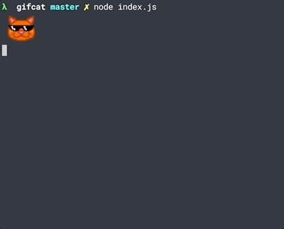

# gifcat

>  Translates words and phrases to a gif and displays it in the terminal.

*Currently supported on [iTerm2 >= 3](https://www.iterm2.com/downloads.html).*

## Demo



## Install

```
$ npm install gifcat
```

## Usage

```js
const gifcat = require('gifcat');

gifcat('web surfing');

gifcat('🐰');

gifcat('wait. what?', { 
    height: '50%',
    save: 'lol.gif',  
});

gifcat('mind blown', { log : false })
    .then(gifString => doSomething(gifString));
    // the resolved promise provides access to the gif string
```

## API

### gifcat(<text>, [options])
 
Logs the matching Gif to the terminal. 
Returns the string used to log the gif in the terminal.

#### text

Type: `string` 

The text input that you want to translate into a gif. 🌈 Emojis are also supported! 🌈
If no text is entered, you'll get a pretty timelapse gif.

#### options

##### stickers

Type: `boolean`<br>
Default: `false`<br>

Use stickers gifs instead of classic gifs.

##### save 
Type: `string` `boolean`<br>
Default: `false`

Saves the gif to a local file.
If `true`, it defaults to `<text>.gif` or `random.gif` if text is left empty.
Otherwise it will save it at the saved path. The `.gif` extension is optional - will add it if it's not there. 

##### clip

Type: `boolean`<br>
Default: `false`

Copy the gif url to your clipboard.

##### width
##### height

Type: `string` `number`<br>us
Default: *width* - `auto` | *height* - `250px`<br>
Options: `Npx` `N%` `N` `auto`

Set gif width/height in pixels(`Npx`), as a % of the terminal view(`N%`), number of char cells(`N`), or allow it to autoscale based on the image dimensions(`auto`).
*Note*: The aspect ratio of the image will be preserved.

##### log
Type: `boolean`<br>
Default: `true`

Doesn't log the gif on the terminal. Useful if you only need the the gif image string.

## Docs

- Giphy API Docs - https://developers.giphy.com/docs

## License 

MIT