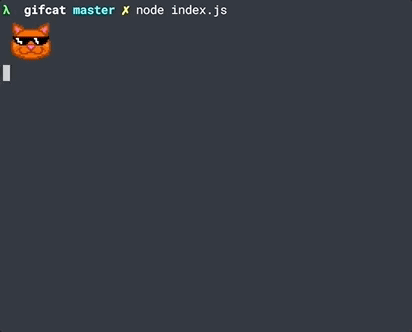

# gifcat

>  Translates words and phrases to a GIF and displays it in the terminal.



*Currently supported on [iTerm2 >= 3](https://www.iterm2.com/downloads.html).*

## Install

```
$ npm install gifcat
```

## Usage

```js
const gifcat = require('gifcat');

gifcat('web surfing');

gifcat('wait. what?', { height: '50%', sticker: true });

```

## API

### gifcat(<text>, [options])
 
Logs the matching Gif to the terminal.<br> 
Returns the string used to log the gif in the terminal.

#### text

Type: `string` 

The text input that you want to translate into a gif.🌈Emojis are also supported!🌈<br>
If no text is entered, you'll get a pretty timelapse gif.

#### options

##### sticker

Type: `boolean`<br>
Default: `false`<br>

Use stickers gifs instead of classic gifs.

##### clip

Type: `boolean`<br>
Default: `false`

Copy the gif url to your clipboard.

##### width
##### height

Type: `string` `number`<br>
Default: *width* - `auto` | *height* - `250px`<br>
Options: `Npx` `N%` `N` `auto`

Set gif width/height in pixels(`Npx`), as a % of the terminal view(`N%`), number of char cells(`N`), or allow it to autoscale based on the image dimensions(`auto`).<br>
*Note*: The aspect ratio of the image will be preserved.

## Docs

- Giphy API Docs - https://developers.giphy.com/docs
- iTerm2 Download- https://www.iterm2.com/downloads.html

## License 

MIT
