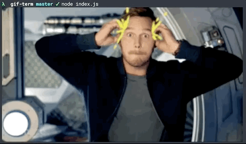

# gif-term [](https://travis-ci.org/astelvida/gif-term)

>  Translate words and phrases to a GIF and display it in the terminal.



*Currently supported on [iTerm2 >= 3](https://www.iterm2.com/downloads.html).*

## Install

```
$ npm install gif-term
```

## Usage

```js
const gifTerm = require('gif-term');

gifTerm('mind blown');

gifTerm('wait. whaaaat?', { clip: true, width: '100%' });
```

## API

### gifTerm(text, [options])
 
Logs the matching Gif to the terminal.

### gifTerm.data(text, [options])

Returns an object with relevant gif data including the image string which you can use to log manually in the terminal.

#### text

Type: `string` 

The text input that you want to translate into a gif. 
Works with emojis too! 🌈

#### options

##### sticker

Type: `boolean`<br>
Default: `false`<br>

Use stickers gifs instead of classic gifs.

##### clip

Type: `boolean`<br>
Default: `false`

Copy the gif url to your clipboard.

##### width
##### height

Type: `string` `number`<br>
Default: `auto`<br>
Options: `Npx` `N%` `N` `auto`

Set the width and height of the image.
 - in pixels(`Npx`)
 - as a % of the terminal view(`N%`)
 - number of char cells(`N`)
 - autoscale based on the image dimensions(`auto`)

*Note*: The aspect ratio of the image will be preserved.

## Related

- [gif-term-cli](https://github.com/astelvida/gif-term-cli) - CLI tool with interactive gif search feature

## Docs

- Giphy API Docs - https://developers.giphy.com/docs
- iTerm2 Download- https://www.iterm2.com/downloads.html

## License 

MIT
